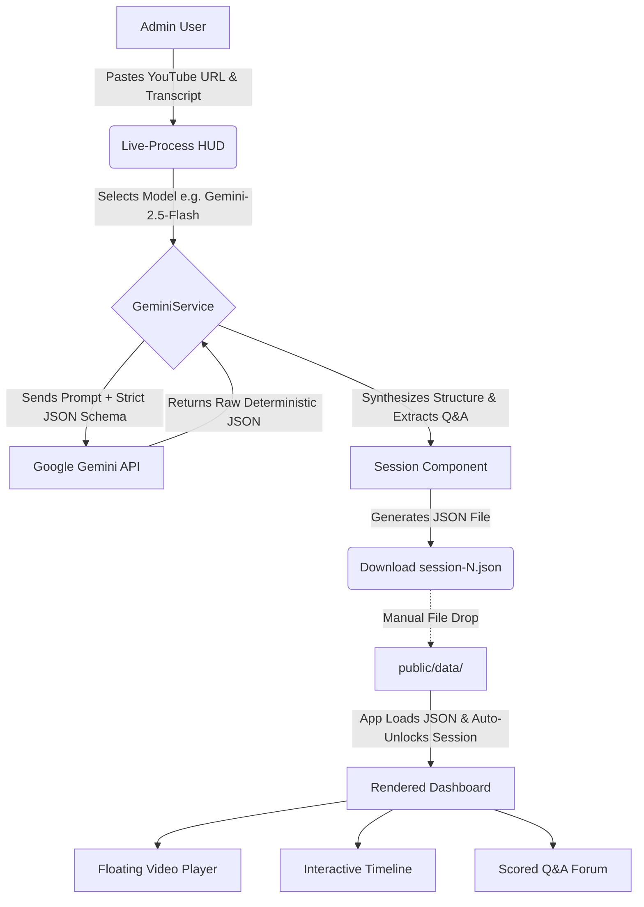

# Agentic AI Course Summarizer

An [Angular 21](https://angular.dev/) standalone application that transforms raw YouTube lecture transcripts into structured, navigable educational dashboards using the [Gemini API](https://ai.google.dev/gemini-api/docs). Instead of relying on rigid third-party frameworks, this app uses a custom, schema-driven orchestration layer to convert unstructured transcripts into a high-fidelity educational experience.

Built for the **EAG v3 Agentic AI Cohort — Session 1 Assignment**.

### 🎥 [Watch the App Demo on YouTube](https://www.youtube.com/watch?v=wyjDPx7xPHs)
[](https://www.youtube.com/watch?v=wyjDPx7xPHs)

---

## 🏗️ Application Architecture



---

## ✨ High-End UI & Core Features

* **Live-Process HUD:** Integrated Admin Interface for real-time, browser-based session generation featuring animated processing states so users always know the pipeline status.
* **Floating Mini-Player:** Leverages the [IntersectionObserver API](https://developer.mozilla.org/en-US/docs/Web/API/Intersection_Observer_API) to automatically shrink and float the embedded video player to the corner when the user scrolls past it.
* **Interactive Timeline:** Clickable timestamped chapter list seamlessly seeks the YouTube player to the exact second.
* **Technical Q&A Forum:** Searchable question list featuring algorithmic 1–5 star "Technical Depth" scoring and dynamic placeholders (e.g., "Search through 67 questions...").
* **Edge-to-Edge Navigation:** Premium sidebar with neon active indicators, monospace badges, and accessible, non-tabbable locked session states.
* **Theme Persistence:** Full Dark/Light mode support seamlessly managed by a dedicated `ThemeService`.
* **Accessibility Enhancements:** Includes keyboard-accessible "Skip-to-Forum" controls to move focus past the embedded iframe directly to the search input.

---

## ⚙️ How It Works (Generating Session Data)

The Agentic AI Course Summarizer uses a streamlined pipeline to transform raw video lectures and transcripts into rich, interactive dashboards. 

1. **Access Admin Mode:** Navigate to any session (e.g., `/session/1`). If no JSON data exists for that session, the Admin HUD will automatically appear.
2. **Select the Intelligence Model:** Choose the underlying LLM to power the summarization (default: `gemini-2.5-flash`).
3. **Input Session Data:** Paste the YouTube URL of the course recording along with the raw session transcript into the provided fields.
4. **Orchestrate the AI Pipeline:** Click **Start Global Pipeline**. The application orchestrates a multi-step AI process behind the scenes. The model reads the transcript, synthesizes the session structure, generates key takeaways, and extracts Q&As.
5. **Dynamic Dashboard Generation:** Once processing is complete, the app instantly populates the rich UI dashboard.
6. **Data Persistence:** Click **Download session-N.json** and move the generated file into your local `public/data/` folder. On the next load, the dashboard will populate automatically and the sidebar lock for that session will clear.

---

## 🚀 Quick Start

### 1. Install dependencies

```bash
npm install
```

### 2. Set up your Gemini API key

Copy the sample environment file and add your key:

```bash
cp src/environments/environment.sample.ts src/environments/environment.ts
```

Edit `src/environments/environment.ts` and replace `YOUR_GEMINI_API_KEY_HERE` with a real key from [Google AI Studio](https://aistudio.google.com). For browser-based use, restrict the key to your allowed referrer origins. **Do not commit real keys to source control.**

### 3. Start the dev server

```bash
npm start
```

Open `http://localhost:4200/` in your browser.

---

## 📄 Session JSON Format

Each file in `public/data/` must conform to this shape:

```json
{
  "sessionId": 1,
  "videoUrl": "[https://youtu.be/](https://youtu.be/)...",
  "sessionOverview": "2–3 sentence plain-text overview.",
  "instructorTakeaways": [
    { "title": "Short title", "body": "2–3 sentence explanation." }
  ],
  "summary": [
    { "timestamp": "MM:SS", "title": "Chapter title" }
  ],
  "qa": [
    { "timestamp": "MM:SS", "speaker": "Name", "question": "...", "answer": "..." }
  ]
}
```

`videoUrl` is injected automatically from the URL field in the Admin HUD — Gemini does not generate it.

---

## ⌨️ Key Commands

| Command | Purpose |
|---|---|
| `npm start` | Dev server at `http://localhost:4200` |
| `npm run build` | Production build into `dist/` |
| `npm test` | Run unit tests ([Vitest](https://vitest.dev/), watch mode) |
| `npm test -- --watch=false` | Run tests once (CI mode) |

---

## 📂 Project Structure

```text
src/
  app/
    core/
      gemini.ts          # Gemini SDK integration & prompt engineering
      syllabus.service.ts # Session metadata, phase grouping, progress
      youtube.ts         # YouTube ID parsing & URL helpers
      theme.service.ts   # Dark/light mode persistence
    session/
      session.ts         # Session page state, loading, generation
      session-helpers.ts # Pure helpers: ratings, filtering, timestamps
  environments/
    environment.sample.ts  # Safe template — commit this
    environment.ts         # Local secrets — never commit
public/
  data/
    session-1.json       # Persisted session data
```

---

## 📝 Implementation Notes

See `IMPLEMENTATION_CONTEXT.md` for the full handoff document covering the generation pipeline, Gemini model guidance, pricing, security notes, and how to pick this project up in a new chat.
