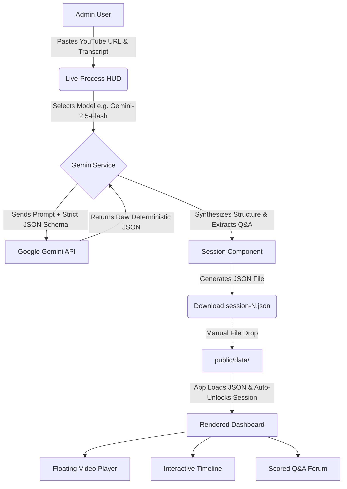

# EAG v3 — Build-Your-Own Orchestrator: Agentic AI Course Summarizer

An Angular 21 standalone application that transforms raw YouTube lecture transcripts into structured, navigable educational dashboards using the Gemini API. Instead of relying on rigid third-party frameworks, this app uses a custom, schema-driven orchestration layer to convert unstructured transcripts into a high-fidelity educational experience.

Built for the **EAG v3 Agentic AI Cohort — Session 1 Assignment**.

### 🎥 [Watch the App Demo on YouTube](https://www.youtube.com/watch?v=DA9RXi07_T8)

---

## 🏗️ Application Architecture



---

## Quick Start

### 1. Install dependencies

```bash
npm install
```

### 2. Set up your Gemini API key

Copy the sample environment file and add your key:

```bash
cp src/environments/environment.sample.ts src/environments/environment.ts
```

Edit `src/environments/environment.ts` and replace `YOUR_GEMINI_API_KEY_HERE` with a real key from [Google AI Studio](https://aistudio.google.com). For browser-based use, restrict the key to your allowed referrer origins. **Do not commit real keys to source control.**

### 3. Start the dev server

```bash
npm start
```

Open `http://localhost:4200/` in your browser.

---

## Generating Session Data

1. Navigate to any unlocked session (e.g. `/session/1`).
2. If no JSON exists for that session, the Admin HUD appears.
3. Select a Gemini model (default: `gemini-2.5-flash`), paste the YouTube URL and transcript, then click **Start Global Pipeline**.
4. Once generation completes, click **Download session-N.json** and move the file to `public/data/`.
5. On next load the dashboard populates automatically and the sidebar lock clears.

---

## Session JSON Format

Each file in `public/data/` must conform to this shape:

```json
{
  "sessionId": 1,
  "videoUrl": "https://youtu.be/...",
  "sessionOverview": "2–3 sentence plain-text overview.",
  "instructorTakeaways": [
    { "title": "Short title", "body": "2–3 sentence explanation." }
  ],
  "summary": [
    { "timestamp": "MM:SS", "title": "Chapter title" }
  ],
  "qa": [
    { "timestamp": "MM:SS", "speaker": "Name", "question": "...", "answer": "..." }
  ]
}
```

`videoUrl` is injected automatically from the URL field in the Admin HUD — Gemini does not generate it.

---

## Key Commands

| Command | Purpose |
|---|---|
| `npm start` | Dev server at `http://localhost:4200` |
| `npm run build` | Production build into `dist/` |
| `npm test` | Run unit tests (Vitest, watch mode) |
| `npm test -- --watch=false` | Run tests once (CI mode) |

---

## Project Structure

```
src/
  app/
    core/
      gemini.ts          # Gemini SDK integration & prompt engineering
      syllabus.service.ts # Session metadata, phase grouping, progress
      youtube.ts         # YouTube ID parsing & URL helpers
      theme.service.ts   # Dark/light mode persistence
    session/
      session.ts         # Session page state, loading, generation
      session-helpers.ts # Pure helpers: ratings, filtering, timestamps
  environments/
    environment.sample.ts  # Safe template — commit this
    environment.ts         # Local secrets — never commit
public/
  data/
    session-1.json       # Persisted session data
```

---

## Implementation Notes

See `IMPLEMENTATION_CONTEXT.md` for the full handoff document covering the generation pipeline, Gemini model guidance, pricing, security notes, and how to pick this project up in a new chat.
